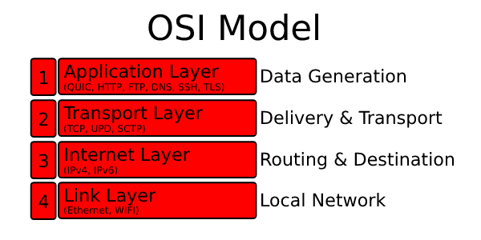

# Transport Protocols

It is an excellent question to ask what protocol suits your project the most. 
Different protocols serve different use cases and the wrong protocol can be catastrophic. 
Before jumping directly into the meat of QUIC, it can be useful to understand its underlying motivations. 
For those motivations we have to inspect the flaws of TCP and nature of UDP, 
because QUIC tries to improve the flaws of TCP ontop of UDP.
 
If your already familiar with terminologies as IP/TCP/UDP and their [transport guarantees][transport-guarantees] and differences feel free to skipp this section. 
For this section we will be using the [Internet protocol suite][internet-protocol-suite] as a guidance. 

Different layers serve different use cases. 
For example, the application layer is not responsible for the data transfer while the transport layer is. 
Both TCP and UDP work on the transport layer while a protocol like QUIC works on the application layer.  
The advantage of this is that routers and firewalls see these protocols as a UDP or TCP instead of QUIC.
Because no special hardware software is needed, it follows that development can be faster and that adoption can occur in parallel.

## IP - Internet Layer

All communication over the internet is happening ontop of IP (Internet Protocol). 
The internet protocol works by splitting data into little chunks called datagrams or packets. 
The chunks are then sent across the internet from one IP address to another.
However, this protocol transfers packets across the network without any guarantee and it is by nature [unreliable][unreliable].
Therefore we need certain specific guarantees. 
This is exactly were transport protocols, like TCP, UPD, and application protocols, like QUIC, HTTP, come in. 

## TCP/IP and UDP Comparison - Transport layer

**TCP:** stands for 'transmission control protocol' and adds certain guarantees ontop of [IP](#ip). 
It forms the backbone for almost everything you do online, from web browsing to IRC to email to file transfer.

**UDP** stands for 'user datagram protocol'  and adds certain guarantees ontop of [IP](#ip), but unlike TCP, 
instead of adding lots of features and complexity, UDP is a very thin layer over IP and is also [unreliable][unreliable] in nature.

| Feature |  TCP  | UDP |
| :-------------: | :-------------: | :-------------:    |
|  [Connection-Oriented][connection-oriented]  |       Yes                              |      No                       |
|  [Transport Guarantees][transport-guarantees] | [Reliable Ordered][reliable-ordered]   |      [Unreliable][unreliable] |
|  Packet Transfer                             | [Stream-based][stream-based]           |      Message based            |
|  Automatic [fragmentation][ip-fragmentation] | Yes                                    |      Yes, but better is to stay below datagram size limit |
|  Header Size                                 |  20 bytes                              |      8 bytes                  |
|  [Control Flow, Congestion Avoidance/Control][congestion-control] | Yes               |      No                       |                                            

[internet-protocol-suite]: https://en.wikipedia.org/wiki/Internet_protocol_suite
[stream-based]: https://en.wikipedia.org/wiki/Stream_(computing)
[congestion-control]: https://en.wikipedia.org/wiki/TCP_congestion_control
[connection-oriented]: https://en.wikipedia.org/wiki/Connection-oriented_communication
[ip-fragmentation]: https://en.wikipedia.org/wiki/IP_fragmentation
[unreliable]: transport-guarantees.md#unreliable
[reliable-ordered]: transport-guarantees.md#reliable-ordered
[reliable-sequenced]: transport-guarantees.md#reliable-sequenced
[transport-guarantees]: transport-guarantees.md